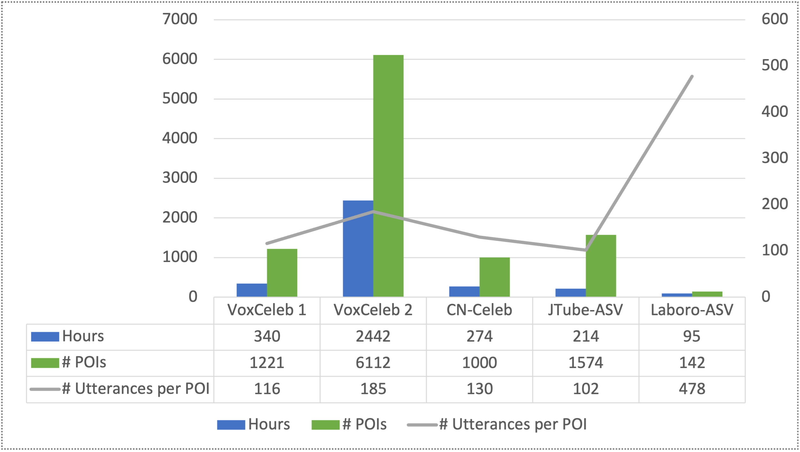
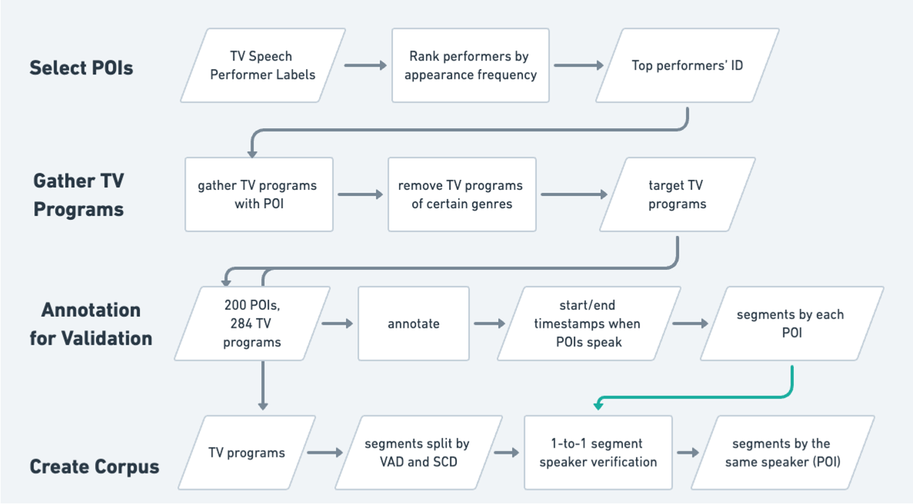
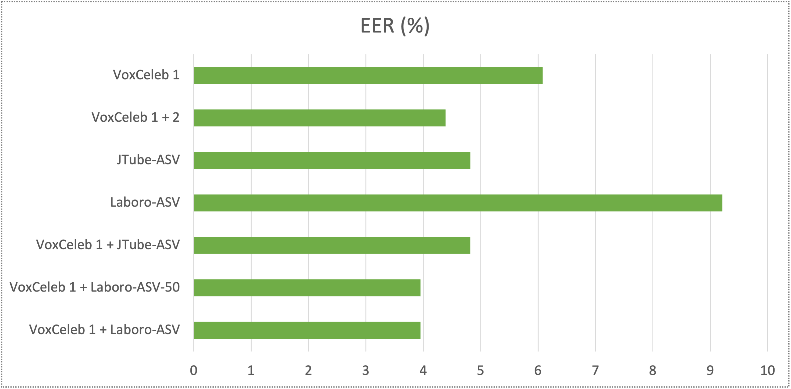

# LaboroTVSpeech-ASV

LaboroTVSpeech-ASV, also shortened as Laboro-ASV, is a dataset for Japanese speaker verification. Similar to [LaboroTVSpeech](https://github.com/laboroai/LaboroTVSpeech) dataset, the source data comes from recordings of Japanese terrestrial TV programs. 

LaboroTVSpeech serves as an excellent dataset for tasks including Japanese speech recognition, while LaboroTVSpeech-ASV focuses on Japanese speaker verification.

## Dataset Statistics



Comparing to large-scale speaker verification datasets like VoxCeleb and CN-Celeb, Laboro-ASV has fewer POIs and total hours, but the average number of utterances per POI is significantly larger.

## Data Collection



## Results



* EER is adopted as the evaluation metric, and lower is better.
* Laboro-ASV dataset works as an effective supplemental dataset for Japanese speaker verification.
* The subset Laboro-ASV-50 includes only the top 50 POIs ranked by the number of utterances, and it also gives the best performance among all tested datasets when used as a supplemental dataset.

## Publications

* This research has been presented at ASJ 2023 Autumn Meeting.
* For more details of this research, please refer to our paper (the link will be added soon) and our [poster](./publications/poster.pdf).
* Please cite this repository if the Laboro-ASV dataset has been used in your research:
```
Laboro.AI Inc., Laboro-ASV, https://github.com/laboroai/LaboroTVSpeech-ASV, 2023
```

## To Obtain the Dataset

The LaboroTVSpeech-ASV dataset is published in the same way as LaboroTVSpeech. To obtain the dataset, please  
   (1) refer to the "LaboroTVSpeechのご利用について" section in [this page](https://laboro.ai/activity/column/engineer/eg-laboro-tv-corpus-jp/)  
   or  
   (2) send an inquiry directly to our company via [this page](https://laboro.ai/contact/other/)  